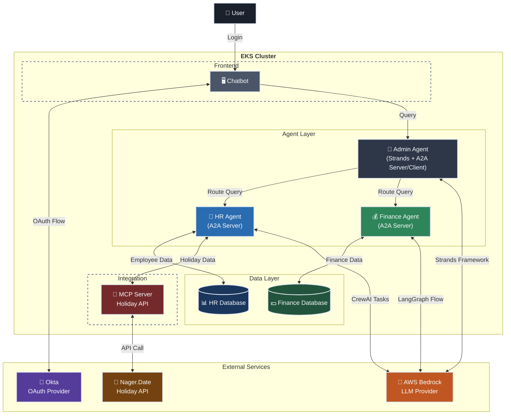

# 🤖 Agentic AI on EKS

[](https://opensource.org/licenses/Apache-2.0)
[](https://kubernetes.io/)
[](https://aws.amazon.com/)
[](https://helm.sh/)

This project demonstrates a **multi-agent platform** deployed entirely on Amazon EKS that simulates an organizational assistant. It features an **Admin/Supervisor agent** that intelligently routes queries to specialized **HR** and **Finance** agents, showcasing agent-to-agent collaboration using the **Agent-to-Agent (A2A) protocol** with OAuth 2.0 security.

## 🏗️ Architecture

The platform simulates an organizational assistant for employee services, implementing a multi-agent workflow where specialized agents collaborate to handle HR inquiries, financial queries, and administrative tasks with skill-based routing and built-in security.

### 🤝 Agent-to-Agent (A2A) Protocol Implementation

The platform showcases **Agent-to-Agent (A2A) communication pattern** where:
- **HR and Finance Agents** act as **A2A servers**, exposing their specialized capabilities through standardized endpoints
- **Admin Agent** serves as an **A2A client**, discovering agent capabilities and routing user requests
- **OAuth Security**: All inter-agent communication is secured using OAuth 2.0 client credentials flow (via Okta in secure mode), ensuring authenticated and authorized access

### 📊 System Overview



### 🔧 Components

#### 🖥️ UI Application
- **Framework**: Streamlit web application
- **Authentication**: Okta OAuth 2.0 authorization code flow
- **Features**: Interactive chat interface with agent communication

#### 🎯 Admin Agent (Supervisor & Router)
- **Framework**: Strands Agent Framework with A2A support
- **Features**:
  - 🧠 **Strands-powered orchestration**: Intelligent multi-agent coordination
  - 🔄 **Dynamic routing**: Context-aware query distribution to specialized agents
  - 🔗 **A2A Protocol**: Full Agent-to-Agent communication with service discovery
  - 📋 **Agent discovery**: Auto-discovers HR and Finance agents via `.well-known/agent.json`
  - 🔐 **OAuth security**: Client credentials flow for secure inter-agent communication
  - 🎭 **Skill-based routing**: Routes queries based on agent capabilities and skills


#### 👥 HR Agent (Employee Assistant)
- **Framework**: CrewAI + A2A Support
- **Database**: SQLite
- **Features**:
  - 📋 Employee directory and information management
  - 🏖️ Vacation day calculations with leave policy management
  - 🎄 **MCP Server Integration**: Real-time public holiday data via Nager.Date API
  - 👥 CrewAI crew-based task execution


#### 💰 Finance Agent (Financial Assistant)  
- **Framework**: LangGraph + A2A Support
- **Database**: SQLite with pre-populated financial data
- **Features**:
  - 💵 Salary and compensation analysis
  - 📊 Leave deduction calculations with payroll impact
  - 🎯 Performance-based financial computations


### 🔧 Tools Integration with MCP

#### 🏗️ MCP Integration
The HR Agent leverages **Model Context Protocol (MCP)** for external data integration:
- **Public Holiday Service**: Real-time holiday data from Nager.Date API
- **Purpose**: Enhances vacation calculations with accurate holiday information
- **Integration**: Seamlessly integrated into CrewAI task workflows

#### 🗄️ Database (SQLite)
- **HR Database**: Auto-generated at startup with employee records, leave policies, and balance tracking
- **Finance Database**: Pre-populated with salary, performance, and department data

### 🔒 Security Architecture

- **🔐 OAuth 2.0 Flow**: Complete authentication using Okta
- **🏷️ JWT Token Validation**: RS256 signature verification with JWKS
- **🎯 Scope-based Authorization**: Fine-grained access control
- **🤝 Agent-to-Agent Security**: Client credentials flow for inter-agent communication

## ✨ Key Features

- ✅ **A2A Implementation** with OAuth 2.0 security
- ✅ **Intelligent Query Routing** using AWS Bedrock LLM
- ✅ **Kubernetes-native Deployment** with Helm charts
- ✅ **Dual Deployment Modes**: Demo (no auth) and Secure (OAuth)


## 📋 Prerequisites

Before deploying the platform, ensure you have:

### Required Tools
- 🔧 **AWS CLI** configured with appropriate permissions
- 🐳 **Docker** installed and running  
- ⚓ **kubectl** configured for your EKS cluster
- 🎯 **Helm 3.8+** for Kubernetes deployments

### AWS Services
- 🤖 **AWS Bedrock** access for Claude 3 Sonnet model
- 📦 **Amazon ECR** for container registry
- ☁️ **Amazon EKS** cluster deployed

### Optional Services
- 🔐 **Okta Account** for OAuth 2.0 (secure mode only)
- 🧠 **Mem0 API Key** for external memory features

## 🚀 Quick Start

### 1️⃣ Infrastructure Setup

Deploy your EKS cluster using Terraform:

```bash
cd infra

# Configure your AWS settings
cp terraform.tfvars.example terraform.tfvars
# Edit terraform.tfvars with your values

# Deploy infrastructure
./install.sh
```

### 2️⃣ Build Container Images

Build and push agent container images to ECR:

```bash
cd ..
# Set your AWS account ID
export ACCOUNT_ID=$(aws sts get-caller-identity --query Account --output text)

# Build all container images
./build-images.sh

# Or build specific components only
./build-images.sh ui              # Build only UI component
./build-images.sh admin hr        # Build admin and HR components

# Available components: admin, hr, finance, ui
```

### 3️⃣ Deploy All Components

Choose your deployment mode based on your requirements:

## 🎭 Demo Mode Deployment

Suitable for **development**, and **testing** purposes, without OAuth complexity.

### Features
- 🚫 **No Authentication**: Bypasses OAuth for easy testing
- ⚡ **Quick Setup**: No OKTA configuration required  
- 🧪 **Demo User**: Pre-configured test user
- 🔓 **Open Access**: All agents accessible without tokens

### Deploy in Demo Mode

```bash
# Set required environment variable
export ACCOUNT_ID=$(aws sts get-caller-identity --query Account --output text)

#Note replace region and name with what you choose in terraform.tfvars
aws eks update-kubeconfig --region us-west-2 --name my-agentic-cluster 

# Deploy in demo mode
./deploy-helm.sh -m demo
```

### Test Demo Deployment

```bash
# Port-forward the UI application
kubectl port-forward svc/agents-ui-app-service 8501:80

# Open browser to http://localhost:8501

```
No login required - start chatting immediately!   

"What is the name of employee EMP0002?"

## 🔒 Secure Mode Deployment  

Recommended for **production** environments with full OAuth 2.0 authentication.

### Features
- 🔐 **Full OAuth 2.0**: Complete Okta integration
- 🛡️ **Token Validation**: JWT verification on all requests
- 👤 **User Authentication**: Okta login required
- 🔑 **Agent-to-Agent Security**: Client credentials flow


2. **Required Environment Variables**:

```bash
# AWS Configuration
export ACCOUNT_ID=your-aws-account-id

# Okta Configuration  
export OKTA_DOMAIN=your-domain.okta.com
export OKTA_AUTH_SERVER_ID=your-auth-server-id

# Admin Agent OAuth (All-Agents-App)
export OKTA_ADMIN_CLIENT_ID=your-admin-client-id
export OKTA_ADMIN_CLIENT_SECRET=your-admin-secret

# UI OAuth (Agent-UI-App)  
export OKTA_UI_CLIENT_ID=your-ui-client-id
export OKTA_UI_CLIENT_SECRET=your-ui-secret
export OKTA_REDIRECT_URI=http://localhost:8501  # Optional
```

### Deploy in Secure Mode

```bash
# Deploy with OAuth enabled
./deploy-helm.sh -m secure
```

### Test Secure Deployment

```bash
# Port-forward the UI application
kubectl port-forward svc/agents-ui-app-service 8501:80

# Open browser to http://localhost:8501
# You'll be redirected to Okta for authentication
```

## 🔄 Management Commands

### Upgrade Existing Deployment

```bash
# Upgrade demo deployment
./deploy-helm.sh -m demo -a upgrade

# Upgrade secure deployment  
./deploy-helm.sh -m secure -a upgrade
```

## 🔍 Validating Agents with A2A Inspector

The platform's agents implement the A2A (Agent-to-Agent) protocol and can be validated using the [A2A Inspector](https://github.com/a2aproject/a2a-inspector) tool.

### What is A2A Inspector?

A2A Inspector is a web-based debugging tool that helps developers:
- 🔎 Inspect agent capabilities via `.well-known/agent.json` endpoints
- ✅ Validate A2A protocol compliance
- 💬 Test agent interactions with live chat
- 🐛 Debug JSON-RPC 2.0 message exchanges

### Setting up A2A Inspector

```bash
# Clone and install A2A Inspector
git clone https://github.com/a2aproject/a2a-inspector.git
cd a2a-inspector

# Install dependencies
uv sync  # Python dependencies
cd frontend && npm install && cd ..  # Frontend dependencies

# Run the inspector
./run.sh
# Access at http://localhost:5173
```

### Validating A2A Agents

1. **Port-forward the agent services** (if running in Kubernetes):
```bash
# Admin agent (use port 8081 to avoid conflicts)
kubectl port-forward svc/agents-admin-agent-service 8081:8080

# HR agent
kubectl port-forward svc/agents-hr-agent-service 9999:80

# Finance agent
kubectl port-forward svc/agents-finance-agent-service 8888:80
```

2. **Connect to agents in A2A Inspector**:
   - Admin Agent: `http://localhost:8081`
   - HR Agent: `http://localhost:9999`
   - Finance Agent: `http://localhost:8888`

3. **Validate agent cards**:
   - Inspector automatically fetches `.well-known/agent.json`
   - Displays agent capabilities, skills, and supported protocols
   - Shows compliance with A2A specification

### What You Can Validate

- **Agent Discovery**: Verify agent metadata and capabilities
- **Skills & Examples**: Review each agent's advertised skills
- **Protocol Compliance**: Check A2A protocol version and transport methods
- **Security Schemes**: Inspect OAuth configuration (in secure mode)

## 🧪 Testing Agent Communication

After deploying the platform with Helm, you can test the multi-agent system through the UI application.

### Accessing the UI Application

1. **Port-forward the UI service** to access it locally:
```bash
kubectl port-forward svc/agents-ui-app-service 8501:80
```

2. **Open your browser** to [http://localhost:8501](http://localhost:8501)

3. **Authentication**:
   - **Demo mode**: No login required - start chatting immediately
   - **Secure mode**: Login with your Okta credentials

### How the System Works

When you send a query through the UI:

1. **UI → Admin Agent**: Your message is sent to the Admin Agent (orchestrator)
2. **Admin Agent Analysis**: Using Strands Framework, it analyzes your query to determine the appropriate agent
3. **Routing Decision**: Routes to HR Agent for employee/vacation queries, or Finance Agent for salary/compensation queries
4. **Agent Processing**: The specialized agent processes the request using its framework (CrewAI for HR, LangGraph for Finance)
5. **Response Flow**: The response flows back through Admin Agent to the UI

### Sample Test Queries

#### 👥 HR Agent Sample Queries
Test these queries to verify HR Agent functionality:

```
💬 "What is the name of employee EMP0002?"
# → Retrieves employee information from HR database

💬 "How many vacation days does employee EMP0001 have left?"  
# → Calculates remaining days based on policy, usage, and carryover
```

#### 💰 Finance Agent Sample Queries
Test these queries to verify Finance Agent functionality:

```
💬 "What is the annual salary of employee EMP0003?"
# → Retrieves salary and compensation details

💬 "Calculate leave deduction for 5 days off for EMP0002"
# → Computes salary impact of taking leave
```

### Monitoring Agent Communication

To see the agent communication in action:

1. **View Admin Agent logs**:
```bash
kubectl logs -l app.kubernetes.io/name=admin-agent -f
```

2. **View HR Agent logs**:
```bash
kubectl logs -l app.kubernetes.io/name=hr-agent -f
```

3. **View Finance Agent logs**:
```bash
kubectl logs -l app.kubernetes.io/name=finance-agent -f
```

### Troubleshooting

If queries aren't working:

1. **Check all pods are running**:
```bash
kubectl get pods -l app.kubernetes.io/instance=agents
```

2. **Verify services are accessible**:
```bash
kubectl get svc -l app.kubernetes.io/instance=agents
```

3. **Check agent cards are returning valid responses**:
```bash
# Port-forward and verify each agent's discovery endpoint
kubectl port-forward svc/agents-admin-agent-service 8080:8080
curl http://localhost:8080/.well-known/agent.json

kubectl port-forward svc/agents-hr-agent-service 9999:80
curl http://localhost:9999/.well-known/agent.json

kubectl port-forward svc/agents-finance-agent-service 8888:80
curl http://localhost:8888/.well-known/agent.json
```

## 📚 Additional Documentation

- 🔐 [Authentication Setup](docs/auth.md)

## 📄 License

This project is licensed under the **Apache License 2.0** - see the [LICENSE](LICENSE) file for details.

---