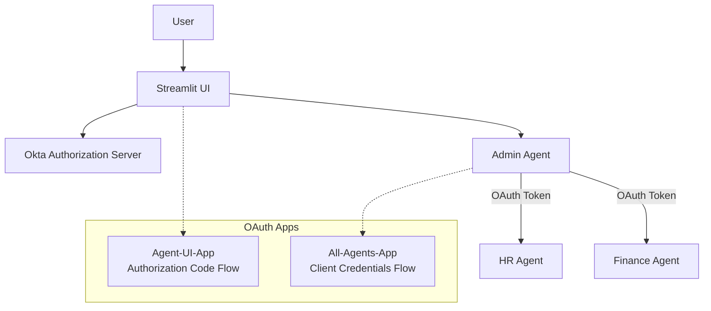

# 🔐 OAuth 2.0 Authentication Setup Guide

This guide walks you through setting up **Okta OAuth 2.0** for the Agentic EKS Platform's **secure mode** deployment. 

> 📖 **For deployment instructions**, see the main [README.md](../README.md#-secure-mode-deployment)

## 🎯 Authentication Overview

The platform supports **two deployment modes**:

| Mode | Authentication | Use Case |
|------|---------------|----------|
| **🎭 Demo Mode** | None (bypass OAuth) | Development, testing, demos |
| **🔒 Secure Mode** | Okta OAuth 2.0 | Secure environments |

This guide covers **secure mode setup** with Okta integration.

### 🏗️ OAuth Architecture



**Two OAuth Applications Required:**
- **🖥️ Agent-UI-App**: User authentication (Authorization Code Flow)
- **🤖 All-Agents-App**: Agent-to-agent communication (Client Credentials Flow)

---

## 📋 Prerequisites

Before starting, ensure you have:

- ✅ **Okta Developer Account** (free at [developer.okta.com](https://developer.okta.com))
- ✅ **Administrative access** to your Okta organization
- ✅ **EKS cluster** with the platform deployed in demo mode first (for testing)

> 💡 **Tip**: Set up Okta while your platform runs in demo mode, then switch to secure mode

---

## 🛠️ Okta Configuration

### Step 1: Create Okta Developer Account

1. **Sign up** at [developer.okta.com](https://developer.okta.com)
2. **Create organization** (e.g., `trial-xxxxxxx.okta.com`)
3. **Verify email** and access the Admin Console
4. **Note your domain**: `your-domain.okta.com` (needed for deployment)

### Step 2: Set Up Authorization Server

1. **Navigate**: Security → API → Authorization Servers
2. **Add Authorization Server**:
   - **Name**: `A2A-AuthServer`
   - **Description**: `Authorization server for agent-to-agent communication`
   - **Audience**: `api://a2a-agents`
   - **Issuer**: Use default value
3. **Save** and **note the Server ID** (needed for deployment)

### Step 3: Create API Scope

1. **Select** your authorization server
2. **Go to Scopes** tab → **Add Scope**
3. **Create scope**:
   - **Name**: `agent.access`
   - **Description**: `Access to agent APIs for A2A communication`
   - **Default scope**: ✅ Checked
4. **Save**

### Step 4: Create Access Policy

1. **Go to Access Policies** tab → **Add Policy**
2. **Policy details**:
   - **Name**: `A2A-Machine-to-Machine`
   - **Description**: `Policy for agent-to-agent authentication`
   - **Assign to**: All clients
3. **Create Policy** → **Add Rule**:
   - **Rule Name**: `Client Credentials Rule`
   - **Grant type**: ✅ Client Credentials
   - **Scopes**: ✅ `agent.access`
   - **Token Lifetime**: 1 hour (recommended)
4. **Create Rule**

---

## 📱 OAuth Applications Setup

### 🖥️ Application 1: Agent-UI-App (User Authentication)

**Purpose**: Handles user login to the Streamlit UI

#### Creation Steps
1. **Navigate**: Applications → **Create App Integration**
2. **Select**: OIDC - OpenID Connect → **Web Application**
3. **App Settings**:
   - **Name**: `Agent-UI-App`
   - **Grant types**: ✅ Authorization Code, ✅ Refresh Token
   - **Client authentication**: ✅ Client secret

#### Redirect URIs Configuration
Add these redirect URIs based on your access method:

```bash
# For local port-forward testing
http://localhost:8501

# For LoadBalancer/Ingress (production)
https://your-domain.com

```

#### Credentials
- **📋 Copy Client ID**: `0oaxxxxxxxxx` (save for deployment)
- **📋 Copy Client Secret**: `xxxxxxxxxxxxx` (save for deployment)

### 🤖 Application 2: All-Agents-App (Agent-to-Agent Auth)

**Purpose**: Handles authentication between backend agents

#### Creation Steps
1. **Navigate**: Applications → **Create App Integration**
2. **Select**: API Services → **Machine-to-Machine**
3. **App Settings**:
   - **Name**: `All-Agents-App`
   - **Grant types**: ✅ Client Credentials only
   - **Client authentication**: ✅ Client secret

#### Scope Assignment
1. **Go to Okta API Scopes** tab
2. **Grant access** to `agent.access` scope
3. **Verify** the scope appears in granted scopes list

#### Credentials
- **📋 Copy Client ID**: `0oaxxxxxxxxx` (save for deployment)
- **📋 Copy Client Secret**: `xxxxxxxxxxxxx` (save for deployment)

---

## 🔑 Environment Variables Setup

After creating both Okta applications, you'll need these environment variables for **secure mode deployment**:

```bash
# AWS Configuration
export ACCOUNT_ID=your-aws-account-id

# Okta Domain & Auth Server
export OKTA_DOMAIN=your-domain.okta.com
export OKTA_AUTH_SERVER_ID=your-auth-server-id

# All-Agents-App Credentials (for Admin Agent)
export OKTA_ADMIN_CLIENT_ID=0oaxxxxxxxxx
export OKTA_ADMIN_CLIENT_SECRET=xxxxxxxxxxxxx

# Agent-UI-App Credentials (for UI)
export OKTA_UI_CLIENT_ID=0oaxxxxxxxxx
export OKTA_UI_CLIENT_SECRET=xxxxxxxxxxxxx

# Optional: Custom redirect URI
export OKTA_REDIRECT_URI=http://localhost:8501
```

> 🔗 **Next Step**: Deploy in secure mode using [these instructions](../README.md#deploy-in-secure-mode)

---

## 🧪 Testing Your OAuth Setup

### 1. Deploy in Secure Mode
```bash
# Set all environment variables above, then:
./deploy-helm.sh -m secure
```

### 2. Test UI Authentication
```bash
# Port-forward the UI service
kubectl port-forward svc/agents-ui-app-service 8501:80

# Access the UI
open http://localhost:8501
```

**Expected Flow**:
1. 🌐 Browser redirects to Okta login
2. 🔐 Enter your Okta credentials  
3. ✅ Successful redirect back to UI
4. 💬 Chat interface becomes available
5. 👤 User info displayed in sidebar

### 3. Test Agent-to-Agent Communication
Try these queries to verify OAuth between agents:

```bash
💬 "What is the name of employee EMP0002?"
# → Should route to HR Agent with OAuth token

💬 "What is the annual salary of employee EMP0003?"  
# → Should route to Finance Agent with OAuth token
```

**Check logs** for successful OAuth token validation:
```bash
kubectl logs -l app.kubernetes.io/instance=agents | grep -i oauth
```
---


## 🔒 Security Best Practices

### Production Deployment Recommendations

- **✅ Use Kubernetes Secrets**: Store credentials in encrypted secrets, not environment variables
- **✅ Rotate Credentials**: Regularly rotate client secrets and tokens
- **✅ Limit Scope Access**: Only grant necessary scopes to applications
- **✅ Monitor Token Usage**: Set up alerts for failed authentication attempts
- **✅ Use HTTPS**: Always use TLS for production redirect URIs
- **✅ Network Policies**: Restrict network access between pods

### Additional Security Measures

- 🔐 **AWS Secrets Manager**: Store sensitive credentials
- 🌐 **Ingress & TLS**: Use proper domain with HTTPS
- 🎯 **Fine-grained Scopes**: Implement specific agent permissions
- ✅ **Input Validation**: Sanitize all user inputs
- 🛡️ **Bedrock Guardrails**: If using AWS Bedrock for model access, make sure. to implement AWS Bedrock security [guardrails](https://aws.amazon.com/bedrock/guardrails/).
- 📊 **Monitoring**: Implement logging and observability
- 🔄 **Token Refresh**: Implement token refresh for long-running sessions

---

## 📚 Additional Resources

- **🏠 [Project Documentation](../README.md)** - Platform overview and deployment
- **🔗 [Okta Developer Docs](https://developer.okta.com/docs/)** - Official Okta documentation
- **🔧 [A2A Protocol Specification](https://github.com/ModelContextProtocol/servers)** - Agent-to-Agent protocol details

---

**⚡ Quick Links:**
- 🎭 [Demo Mode Deployment](../README.md#-demo-mode-deployment) - Test without OAuth
- 🔒 [Secure Mode Deployment](../README.md#-secure-mode-deployment) - Production with OAuth  
- 🧪 [Testing Guide](../README.md#-testing-agent-communication) - Query examples and workflows