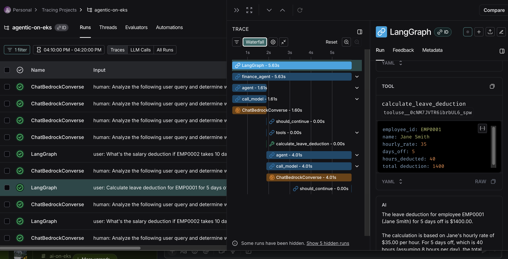
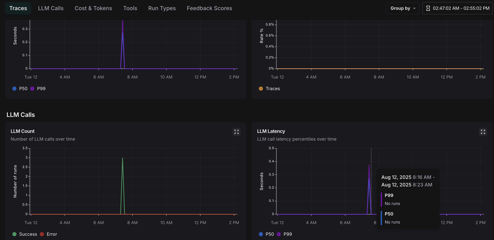
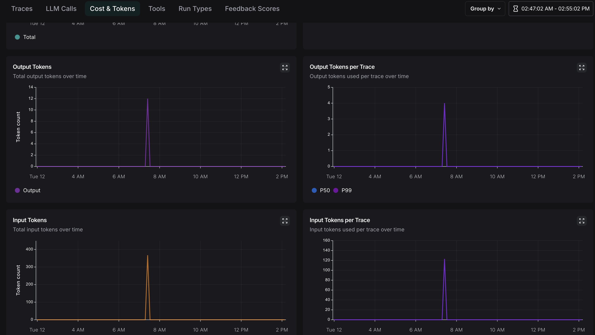

# Monitoring Setup for Agentic-on-EKS

This directory contains the monitoring configuration for your AI agent platform deployed on Amazon EKS.

## 📋 **Prerequisites**

Before setting up monitoring, ensure you have:

1. **EKS Cluster Deployed** - Via Terraform in `/infra` directory
2. **Agents and UI Deployed** - Using Helm charts:
   ```bash
   # Deploy agents and UI first
   ./deploy-helm.sh -m demo  # or -m secure for production
   
   # Verify deployments are running
   kubectl get deployments | grep agents-
   kubectl get pods | grep agents-
   ```
3. **kubectl Configured** - Connected to your EKS cluster
4. **LangSmith Account** - Sign up at https://smith.langchain.com/ (free tier available)

## 🚀 **Quick Setup (Recommended)**

```bash
# Step 1: Deploy agents and UI (if not already done)
./deploy-helm.sh -m demo

# Step 2: Set up monitoring
./monitoring/deploy-monitoring.sh

# Step 3: Port-forward the UI service
kubectl port-forward svc/agents-ui-app-service 8501:80

# Step 4: Access UI and generate traffic
# Open http://localhost:8501 in your browser
# Interact with agents to generate traces

# Step 5: View your dashboard at https://smith.langchain.com/
```

**That's it!** Your agents are now monitored with LangSmith.

## 🎯 **Overview**

The monitoring system provides:
- **LangSmith Cloud**: Full dashboard with charts and metrics
- **Agent tracing**: Monitor your AI agents' performance and interactions

## 🔄 **Complete Monitoring Workflow**

1. **Setup Monitoring** → `./monitoring/deploy-monitoring.sh`
   - Configures all agents with LangSmith environment variables
   - Restarts deployments to apply changes
   - Verifies setup is complete

2. **Generate Traffic** → `./monitoring/traffic-generator.sh`
   - Creates diverse queries across all agents
   - Runs for 3 minutes by default (configurable)
   - Generates rich trace data for analysis

3. **View Dashboard** → https://smith.langchain.com/
   - Real-time traces and performance metrics
   - Agent interaction analysis
   - Error tracking and debugging

## 🚀 **Quick Start - Get Full Dashboard with Charts**

### **LangSmith Cloud Setup (Recommended)**

This gives you the full dashboard with charts and comprehensive monitoring.

#### **Option 1: Automated Setup (Recommended)**
```bash
# Run the automated monitoring setup script
./monitoring/deploy-monitoring.sh
```

This script will:
- ✅ Check prerequisites (kubectl, deployments)
- ✅ Prompt for your LangSmith API key
- ✅ Automatically configure all agents
- ✅ Set all required environment variables
- ✅ Restart deployments to apply changes
- ✅ Verify the setup
- ✅ Test connectivity to LangSmith

#### **Option 2: Manual Setup**
If you prefer manual setup or need to customize:

**Step 1: Get Your LangSmith Cloud API Key**
1. Go to [https://smith.langchain.com/](https://smith.langchain.com/)
2. Sign up/Sign in to your account
3. Navigate to your project settings
4. Copy your API key (starts with `ls_...`)

**Step 2: Switch Agents to LangSmith Cloud**
```bash
# Update API key for all agents
kubectl set env deployment/agents-admin-agent LANGCHAIN_API_KEY=ls_your_actual_api_key_here
kubectl set env deployment/agents-finance-agent LANGCHAIN_API_KEY=ls_your_actual_api_key_here  
kubectl set env deployment/agents-hr-agent LANGCHAIN_API_KEY=ls_your_actual_api_key_here

# Update endpoint to LangSmith Cloud
kubectl set env deployment/agents-admin-agent LANGCHAIN_ENDPOINT=https://api.smith.langchain.com
kubectl set env deployment/agents-finance-agent LANGCHAIN_ENDPOINT=https://api.smith.langchain.com
kubectl set env deployment/agents-hr-agent LANGCHAIN_ENDPOINT=https://api.smith.langchain.com
```

#### **Step 3: Access Your Dashboard**
1. Go to [https://smith.langchain.com/](https://smith.langchain.com/)
2. Select your project (should be "agentic-on-eks")
3. Enjoy your full dashboard with:
   - 📊 Real-time charts and metrics
   - 🔍 Trace visualization
   - 📈 Performance analytics
   - 🚀 Agent interaction logs


## 📁 **Files in This Directory**

- `deploy-monitoring.sh` - **Automated monitoring setup script (recommended)**
- `traffic-generator.sh` - **Traffic generator to populate LangSmith dashboard**
- `README.md` - This documentation

## 🔧 **Configuration Details**

### **Environment Variables for Cloud LangSmith**
```yaml
LANGCHAIN_TRACING_V2: "true"           # Enable tracing
LANGCHAIN_ENDPOINT: "https://api.smith.langchain.com"  # Cloud endpoint
LANGCHAIN_API_KEY: "ls_your_api_key"   # Your API key
LANGCHAIN_PROJECT: "agentic-on-eks"    # Project name
LANGCHAIN_TRACING: "true"              # Enable tracing
```

## 🚀 **Getting Started**

### **Complete End-to-End Setup (Recommended)**
```bash
# 1. Set up monitoring (configures all agents)
./monitoring/deploy-monitoring.sh

# 2. Generate traffic to populate dashboard
./monitoring/traffic-generator.sh

# 3. View your populated dashboard
# Go to: https://smith.langchain.com/
# Select project: 'agentic-on-eks'
```

### **For Manual Setup**
1. Get your LangSmith Cloud API key
2. Update agent environment variables (see Step 2 above)
3. Access your dashboard at [https://smith.langchain.com/](https://smith.langchain.com/)

## 📊 **What You'll See in LangSmith Cloud**

- **Real-time Traces**: Every agent interaction and LLM call
- **Performance Metrics**: Response times, token usage, cost tracking
- **Agent Interactions**: How agents communicate and route requests
- **Error Tracking**: Failed requests and debugging information
- **Custom Metadata**: User IDs, session tracking, business metrics

## 🔍 **Troubleshooting**

### **Verify LangSmith Environment Variables**

**IMPORTANT**: After running the monitoring setup, verify that all required environment variables are set correctly:

```bash
# Check all LangSmith environment variables for each agent
echo "=== Admin Agent ==="
kubectl describe deployment agents-admin-agent | grep -E "LANGCHAIN_|LANGSMITH_" || echo "No LangSmith vars found!"

echo "\n=== HR Agent ==="
kubectl describe deployment agents-hr-agent | grep -E "LANGCHAIN_|LANGSMITH_" || echo "No LangSmith vars found!"

echo "\n=== Finance Agent ==="
kubectl describe deployment agents-finance-agent | grep -E "LANGCHAIN_|LANGSMITH_" || echo "No LangSmith vars found!"
```

**Expected output should include:**
- `LANGCHAIN_TRACING_V2: true`
- `LANGCHAIN_ENDPOINT: https://api.smith.langchain.com`
- `LANGCHAIN_API_KEY: lsv2_pt_...` (your API key)
- `LANGCHAIN_PROJECT: agentic-on-eks`
- `LANGCHAIN_TRACING: true`

### **Quick Verification Script**
```bash
# One-liner to check all agents at once
for deployment in agents-admin-agent agents-hr-agent agents-finance-agent; do 
  echo "Checking $deployment:"; 
  kubectl get deployment $deployment -o jsonpath='{.spec.template.spec.containers[0].env[?(@.name=="LANGCHAIN_API_KEY")].value}' | grep -q "ls" && echo "✅ LangSmith configured" || echo "❌ LangSmith NOT configured"; 
done
```

### **Common Issues**
1. **No traces appearing**: 
   - Verify environment variables are set (use commands above)
   - For traffic generator: Ensure Admin Agent is port-forwarded: `kubectl port-forward svc/agents-admin-agent-service 8080:8080`
   - For UI usage: Ensure UI is port-forwarded: `kubectl port-forward svc/agents-ui-app-service 8501:80`
   - Check API key is valid and starts with `lsv2_` or similar
   
2. **Authentication errors**: 
   - Verify your LangSmith Cloud API key
   - Re-run setup: `./monitoring/deploy-monitoring.sh`
   
3. **Project not found**: 
   - The project is created automatically on first trace
   - Make sure to interact with agents via UI to generate traces

### **Manual Fix if Variables Missing**
```bash
# If environment variables are missing, set them manually
export LANGSMITH_API_KEY="your_actual_api_key_here"

for deployment in agents-admin-agent agents-hr-agent agents-finance-agent; do
  kubectl set env deployment/$deployment \
    LANGCHAIN_TRACING_V2=true \
    LANGCHAIN_ENDPOINT=https://api.smith.langchain.com \
    LANGCHAIN_API_KEY=$LANGSMITH_API_KEY \
    LANGCHAIN_PROJECT=agentic-on-eks \
    LANGCHAIN_TRACING=true
done

# Restart deployments
kubectl rollout restart deployment/agents-admin-agent deployment/agents-hr-agent deployment/agents-finance-agent
```

### **Using the Automated Script for Troubleshooting**
```bash
# Get help and see what the script does
./monitoring/deploy-monitoring.sh --help

# Re-run the setup if you need to reconfigure
./monitoring/deploy-monitoring.sh

# Check if deployments exist (script will do this automatically)
kubectl get deployments | grep agents-

# Check specific agent deployment status
kubectl get deployment agents-admin-agent
kubectl get deployment agents-finance-agent
kubectl get deployment agents-hr-agent
```

## 🎯 **Next Steps**

1. **Get your LangSmith API key** from [https://smith.langchain.com/](https://smith.langchain.com/)
2. **Update agent environment variables** using the kubectl commands above
3. **Monitor your agents** in real-time through the cloud dashboard
4. **Set up alerts** for performance issues or errors

## 💡 **Benefits of LangSmith**

- **No local infrastructure** to manage or maintain
- **Full dashboard experience** with charts and analytics
- **Automatic scaling** and high availability
- **Professional monitoring** with enterprise features
- **Cost-effective** usage-based pricing
- **Team collaboration** with shared dashboards

## 🎯 **Populate Your LangSmith Dashboard**

After setting up monitoring, you'll want to generate some traffic to see traces in your dashboard.

### **Quick Traffic Generation**
```bash
# Generate 3 minutes of diverse traffic to all agents
./monitoring/traffic-generator.sh
```

### **Custom Traffic Generation**
```bash
# Generate traffic for 5 minutes
./monitoring/traffic-generator.sh -d 300

# Send queries every 10 seconds instead of 5
./monitoring/traffic-generator.sh -i 10

# Get help and see all options
./monitoring/traffic-generator.sh --help
```

### **What the Traffic Generator Does**
- 🎭 **Diverse queries** - 25+ different query types with real employee data
- ⏱️ **Realistic timing** - configurable intervals and duration
- 🔄 **Real HTTP requests** - sends actual queries to Admin Agent service
- 📊 **Rich traces** - creates comprehensive monitoring data via routing
- 🎯 **Dashboard ready** - populates LangSmith with realistic agent interactions

### **Prerequisites for Traffic Generator**
Before running the traffic generator, you need:

1. **Port-forward to Admin Agent:**
   ```bash
   kubectl port-forward svc/agents-admin-agent-service 8080:8080 &
   ```

2. **Verify Admin Agent is accessible:**
   ```bash
   curl http://localhost:8080/.well-known/agent.json
   ```

### Sample Run and Output

```
./monitoring/traffic-generator.sh -d 30 -i 5 
🚀 Traffic Generator for LangSmith Dashboard
============================================

[SUCCESS] Configuration validated:
[INFO]   Duration: 30 seconds
[INFO]   Query interval: 5 seconds
[INFO]   Estimated queries: 18
[INFO] Checking if Admin Agent service is accessible...
[SUCCESS] Found Admin Agent service
[SUCCESS] Admin Agent is accessible on port 8080
[SUCCESS] Connected to: Admin Agent
Admin Agent

[INFO] Ready to generate traffic!
[INFO] Press Ctrl+C to stop early

[INFO] Starting traffic generation for 30 seconds...
[INFO] Sending queries every 5 seconds...
[INFO] All queries will be sent to Admin Agent for routing

[INFO] Elapsed: 0s | Remaining: 30s | Queries sent: 0
[TRAFFIC] Sending: What's the leave policy for employee EMP0002?
[SUCCESS] Query processed successfully (HTTP 200)
  Response snippet: root=SendMessageSuccessResponse(id='066c1a1c-49d1-...

[INFO] Waiting 5s before next query...
[INFO] Elapsed: 12s | Remaining: 18s | Queries sent: 1
[TRAFFIC] Sending: Get employee directory information for EMP0010
[SUCCESS] Query processed successfully (HTTP 200)
  Response snippet: root=SendMessageSuccessResponse(id='4d0cb064-3272-...

[INFO] Waiting 5s before next query...
[INFO] Elapsed: 25s | Remaining: 5s | Queries sent: 2
[TRAFFIC] Sending: I need assistance with HR and Finance
[SUCCESS] Query processed successfully (HTTP 200)
  Response snippet: root=SendMessageSuccessResponse(id='58b2debb-a695-...

[SUCCESS] Traffic generation complete!
[SUCCESS] Total queries sent: 3
[SUCCESS] Duration: 30 seconds
```

### Langsmith Sample Dashboard

Sample real time dashboards for agents are seen below:

**Callflow Trace**



**LLM Trace**



**Tokens Trace**

